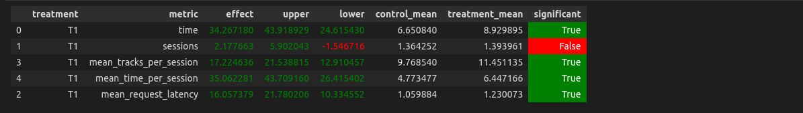
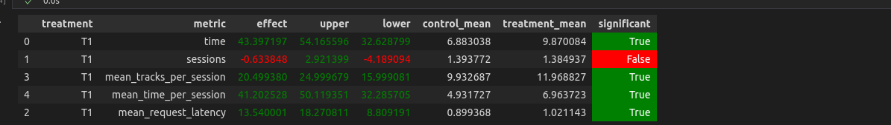

Домашняя работа

### Ссылка на репозиторий

https://github.com/IlyasLatypov/recsys-itmo-spring-2023

### Краткое описание результатов

Разработан алгоритм рекомендательной системы, который улучшает значение метрики *mean_time_per_session* относительно полученного на лекции

Отмечу, что рекомендер предложенный на семинаре высокого качества и исследованные изменения нейросети в рамках выполнения ДЗ, зачастую ухудшали его. 
Поэтому при решении внимание было на увелечении:
   - объема данных для обучения, что позволило увеличить размер эмбединга трека 
   - релевантности самой рекомендательной системы (логики рекомендаций)

Результат достигнут благодаря:
    - дополнительным данным для обучения нейросети
    - увеличению размерности эмбединга до 120
    - уменьшению кол-ва соседей до 50, что увеличивает релевантность рекомендаций
    - применение цепочки рекомендаций за место случайной рекомендации и в случае если текущий рек слушали не долго

### Описание решения

1. Собраны дополнительные данные для обучения (data_hw.json), на лекции сообщалось, что студентам можно делиться данными для обучения 
данные (data_hw.json) расположены по ссылке: https://drive.google.com/file/d/19pm0-hcz5DVYHBn4JTja55tq3znKLcUt/view?usp=share_link

2. На обучение выделено больших процент данных - 90%

2. Изменен размер эмбединга до 120. 

3. На основании новых данных (data_hw.json) был настроен рекомендер и сформирован файлы с рекомендованными треками (топ 100 и 50).
данныерасположены в botify\data и по ссылкам: 
   - tracks_with_recs_HW_100.json - https://drive.google.com/file/d/1sAe0ySvLqBa0IvVDFq0wuT3-aj8Vv9pY/view?usp=share_link
   - tracks_with_recs_HW_50.json   - https://drive.google.com/file/d/1-0Ca8zAv-pC8P8XVejf67j8qhEsUNvhV/view?usp=share_link

Для рекомендора выбраны рекомендации tracks_with_recs_HW_50.json так как они получились более релевантными 

Файл в котором обучалась нейросеть: Week4Seminar_HW.ipynb

4. Применена цепочка рекомендаций: MyRecommender -> Indexed -> TopPop -> StickyArtist -> Random за место Random в случае если рекомдации нейросети нет в БД 
    В случае если текущий трек слушали не долго (prev_track_time <= 0.4), то есть трек не нравиться то на основании него рекомендовать не правильно 
    и в этом случае тоже применяется цепочка рекомендаций

5. Для сравнения рекомендеров добавлены: БД REDIS_MY_TRACKS, файл tracks_with_recs_HW_50.json и соответствующая загрузка в коде

### Результаты A/B эксперимента (top 100)

### Результаты A/B эксперимента (top 50)

Файл в котором оценивался эксперимент: Week1Seminar_HW.ipynb

### Инструкция по запуску эксперимента
cd botify

sudo docker compose up -d --build

cd ../sim

conda create --name env python=3.7

conda activate env

pip install -r requirements.txt

export PYTHONPATH=${PYTHONPATH}:.

python sim/run.py --episodes 1000 --config config/env.yml single --recommender remote --seed 31337 

docker cp recommender-container:/app/log/ /tmp/recsys

